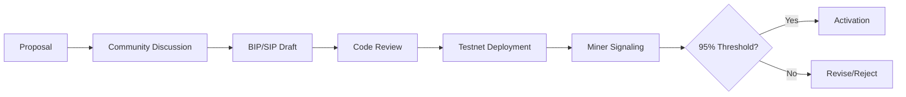

# Soqucoin Governance Documentation
**Version:** 1.0  
**Status:** P8-01 Compliance Document  
**Model:** Based on Dogecoin Foundation governance  
**Last Updated:** 2026-01-26

---

## Executive Summary

Soqucoin follows a **community-driven governance model** similar to Dogecoin, with the addition of the **Soqucoin Foundation** for protocol stewardship and **Soqucoin Labs** for commercial development.

---

## Governance Structure

### 1. Protocol Governance (Decentralized)

| Component | Description |
|-----------|-------------|
| **Consensus Changes** | Flag-day height activation, scheduled in a released binary after audit clearance |
| **Hard Forks** | Require community consensus + miner majority |
| **Emergency Changes** | Core maintainer discretion for critical security |

### 2. Soqucoin Foundation (Non-Profit)

**Entity Type:** Wyoming Non-Profit Corporation  
**Purpose:** Protocol stewardship, not commercial value capture

| Role | Responsibility |
|------|----------------|
| Protocol Maintenance | Core codebase security & updates |
| Documentation | Public documentation & standards |
| Community Outreach | Developer relations & education |
| Trademark Stewardship | Protect Soqucoin™, SOQ™, sSOQ™, USDSOQ™ marks |

**Foundation Does NOT:**
- Control consensus rules unilaterally
- Hold or manage user funds
- Operate for profit

### 3. Soqucoin Labs (Commercial)

**Entity Type:** For-profit commercial development  
**Purpose:** Commercial products, enterprise services

| Role | Responsibility |
|------|----------------|
| Wallet Development | pqwallet, mobile apps |
| Enterprise Solutions | Custom integrations |
| Mining Infrastructure | Pool development, hosting |
| Business Development | Partnerships, listings |

---

## Decision-Making Process

### Protocol Changes

```mermaid
flowchart LR
    A[Proposal] --> B[Community Discussion]
    B --> C[BIP/SIP Draft]
    C --> D[Code Review]
    D --> E[Testnet Deployment]
    E --> F[Miner Signaling]
    F --> G{95% Threshold?}
    G -->|Yes| H[Activation]
    G -->|No| I[Revise/Reject]
```

### Soft Fork Activation (Flag-Day by Height)

Soqucoin does not use BIP9 miner signaling. The chain is merge-mined, so its hashpower
is mercenary Scrypt capacity with no stake in protocol governance; a signaling vote would
either stall on apathy or reduce to the foundation voting with itself. Instead, each
soft fork carries an activation height (`nActivationHeight`):

| Parameter | Value |
|-----------|-------|
| Dormant state | `NOT_SCHEDULED` (feature shipped, not enforceable) |
| Activation trigger | Security-audit clearance |
| Scheduling | Activation height set in a released binary, announced in release notes |
| Enforcement | Consensus-enforced for every block at or above the height |

---

## Key Holders & Roles

### Foundation Board

| Role | Responsibility | Key Access |
|------|----------------|------------|
| **Executive Director** | Strategic direction | None (governance only) |
| **Technical Lead** | Protocol decisions | GitHub maintainer |
| **Secretary** | Legal compliance | Document signing |

### Development Roles

| Role | Access Level |
|------|--------------|
| Core Maintainers | Merge to `main` branch |
| Contributors | Pull request submission |
| Reviewers | Code review & approval |

### Multi-Sig Requirements

| Asset | Signers Required | Total Signers |
|-------|------------------|---------------|
| Foundation Treasury | 2-of-3 | 3 |
| Protocol Emergency Fund | 3-of-5 | 5 |
| Bug Bounty Fund | 2-of-3 | 3 |

---

## Emission Schedule

Soqucoin follows Dogecoin's emission model with minor adjustments:

### Block Rewards

| Height | Reward | Notes |
|--------|--------|-------|
| 1 – 250,000 | 100,000 SOQ | Genesis phase |
| 250,001 – 500,000 | 50,000 SOQ | First halving |
| 500,001 – 750,000 | 25,000 SOQ | Second halving |
| 750,001 – 1,000,000 | 12,500 SOQ | Third halving |
| 1,000,001+ | 2,500 SOQ | Perpetual tail emission |

### Tail Emission Rationale

Like Dogecoin, Soqucoin uses **perpetual tail emission** (no supply cap) to:
- Incentivize mining security long-term
- Replace lost coins over time
- Maintain transaction fee competitiveness

**Annual Inflation:** ~1.31B SOQ/year at tail (declining; ~2.7% at head completion)

---

## Upgrade Process

### Staged Activation (Mainnet)

| Phase | Description | Timeline |
|-------|-------------|----------|
| **Testnet** | Feature testing | 2+ weeks |
| **Stagenet** | Mainnet rehearsal | 1+ week |
| **Audit** | Independent security review clears the feature | Per audit scope |
| **Scheduling** | Activation height published in a released binary | Release notes |
| **Activation** | Consensus enforcement begins at the height | Height-based |

### Current Deployments

| Feature | Status | Activation |
|---------|--------|------------|
| Dilithium Signatures | ✅ ACTIVE | Genesis |
| SegWit | ✅ ACTIVE | Always-active |
| CSV (BIP68/112/113) | ✅ ACTIVE | Always-active |
| PAT / LatticeFold+ | ✅ ACTIVE | Always-active |
| Lattice-BP++, USDSOQ, CTV, APO, CSFS, P2WSH-Dilithium, UTXO Cost, Dilithium Keyhash, V6 Control Flow | 🟡 DORMANT on mainnet | Flag-day height, set after audit clearance (active on test networks) |

---

## Security Governance

### Vulnerability Disclosure

See [INCIDENT_RESPONSE_PLAN.md](INCIDENT_RESPONSE_PLAN.md) for:
- Severity classification
- Response timelines
- Escalation procedures

### Bug Bounty Program

| Severity | Reward Range |
|----------|--------------|
| Critical | $5,000 - $25,000 |
| High | $1,000 - $5,000 |
| Medium | $250 - $1,000 |
| Low | Recognition |

**Scope:** Core protocol, consensus, cryptography, RPC

---

## Community Participation

### How to Contribute

1. **Code:** Submit PRs to [github.com/soqucoin/soqucoin](https://github.com/soqucoin/soqucoin)
2. **Documentation:** Improve docs via PRs
3. **Discussion:** GitHub Discussions or Discord
4. **Testing:** Run testnet/stagenet nodes

### Governance Participation

- **Miners:** Signal for/against protocol upgrades
- **Node Operators:** Choose software version to run
- **Community:** Participate in discussions, provide feedback

---

## Comparison to Dogecoin

| Aspect | Dogecoin | Soqucoin |
|--------|----------|----------|
| Foundation | Dogecoin Foundation | Soqucoin Foundation |
| Consensus | SHA-256 (merged-mined) | Scrypt (AuxPoW capable) |
| Signatures | ECDSA | **Dilithium (PQ-safe)** |
| Block Time | 1 minute | 1 minute |
| Tail Emission | 10,000 DOGE/block | 2,500 SOQ/block |
| Governance | BIP9 soft forks | Flag-day height activation |

**Key Differentiator:** Soqucoin is the **first quantum-resistant Scrypt chain**.

---

## Document History

| Version | Date | Changes |
|---------|------|---------|
| 1.0 | 2026-01-26 | Initial P8-01 compliance document |

---

*This document addresses finding P8-01: Governance Documentation*
